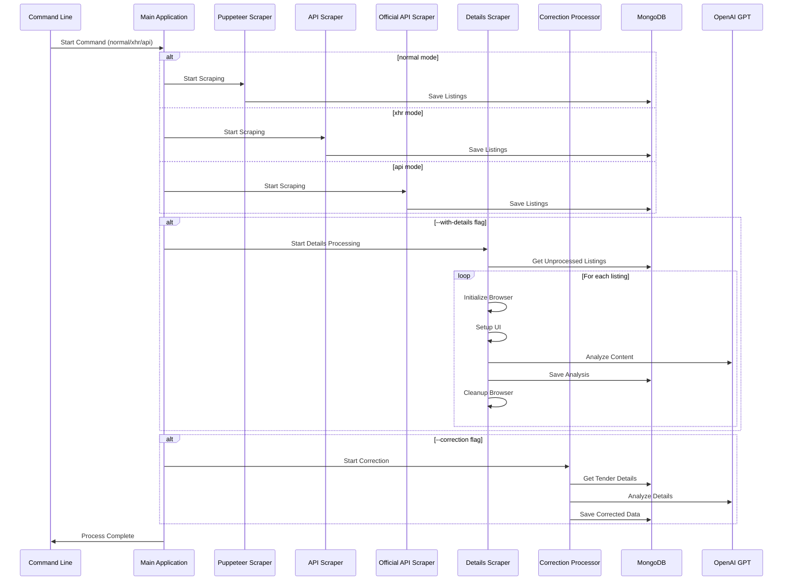

# Tender Scraping System

A comprehensive system for scraping and analyzing tender data from ezamowienia.gov.pl, with support for multiple scraping methods and AI-powered analysis.

## Requirements

- Node.js (v14 or higher)
- MongoDB
- Chrome/Chromium browser
- OpenAI API key (for analysis features)

## Installation

1. Clone the repository:
```bash
git clone <repository-url>
cd tender-scraper
```

2. Install dependencies:
```bash
npm install
```

3. Create a `.env` file:
```env
MONGO_URL=mongodb://localhost:27017
MONGO_DB=tenders_db
OPENAI_API_KEY=your_openai_api_key
CHROME_PATH=/path/to/chrome  # Optional
```

## Usage

### Basic Scraping Commands

1. **Puppeteer Scraper (Default)**
```bash
# Run with headless browser
node index.js normal --server

# Run with visible browser
node index.js normal --presentation
```

2. **XHR API Scraper**
```bash
node index.js xhr
```

3. **Official API Scraper**
```bash
node index.js api
```

### Advanced Options

1. **Details Processing**
```bash
# Run with details processing
node index.js normal --with-details

# Run only details processing
node index.js normal --only-details

# Run details with visible browser
node index.js normal --only-details --presentation
```

2. **Correction Processing**
```bash
# Run correction processor
node index.js normal --correction
```

## Configuration

### Browser Settings
In `config.js`:
```javascript
puppeteer: {
    launch: {
        headless: true/false,  // Control browser visibility
        defaultViewport: null,
        args: [
            '--no-sandbox',
            '--disable-setuid-sandbox',
            '--window-size=1920,1080'
        ]
    }
}
```

### MongoDB Collections

- `tender_listings_{scraper_type}`: Basic tender information
- `tender_details`: Detailed tender information
- `tender_analysis`: AI-processed analysis results

## Features

- Multiple scraping methods (Puppeteer, XHR, Official API)
- AI-powered tender analysis using OpenAI GPT
- Automatic browser user-agent rotation
- Detailed logging system
- Visual progress tracking for details processing
- Error recovery and retry mechanisms

## Logging

Logs are stored in the `logs` directory:
- `combined.log`: All log levels
- `error.log`: Error-level logs only

## Error Handling

The system includes:
- Automatic retry mechanisms
- Browser session recovery
- Connection error handling
- Process cleanup on errors

## Development

To modify the system:

1. **Browser Configuration**
```javascript
// Modify browser settings in initBrowser()
async initBrowser() {
    this.browser = await puppeteer.launch({
        headless: config.puppeteer.launch.headless,
        defaultViewport: { width: 1920, height: 1080 },
        // ... other settings
    });
}
```

2. **User Agent Rotation**
```javascript
// Use random user agent
await this.page.setUserAgent(getRandomUserAgent());
```

## Contributing

1. Fork the repository
2. Create your feature branch
3. Commit your changes
4. Push to the branch
5. Create a Pull Request

## License
This project is licensed under the MIT License.

